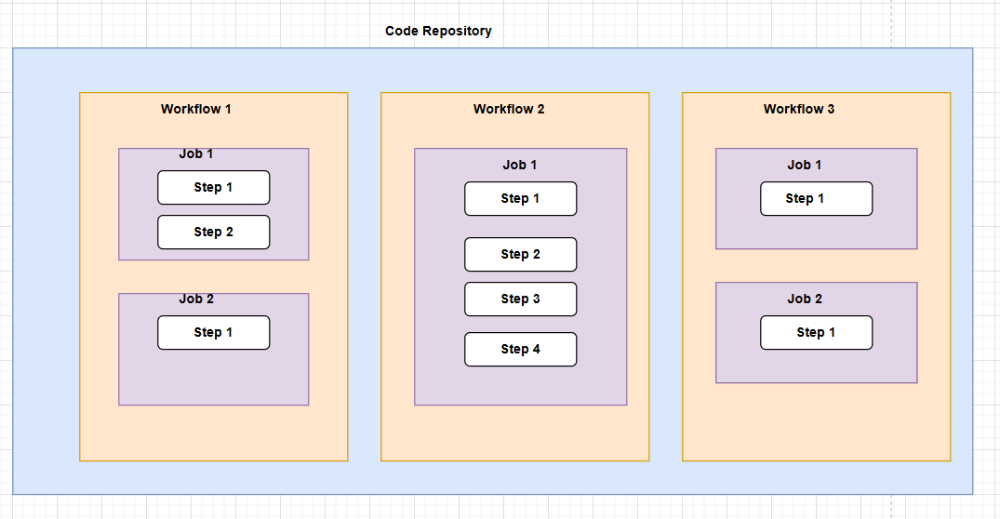

# 🚀 GitHub Actions — Concepts & Notes

A simple and clear guide to understand the **core concepts of GitHub Actions** — **Workflows**, **Jobs**, and **Steps**.

---

## 🧩 Overview

GitHub Actions automates tasks like CI/CD, testing, deployments, and code scanning.

Workflows are defined as YAML files under:
.github/workflows/*.yml

Each workflow runs based on specific triggers (push, PR, schedule, or manually via workflow dispatch).

---

## ⚙️ 1. Workflow

A **workflow** is an automated process defined in a YAML file.  
It defines **when** to run and **what** to execute.

### 🔹 Key points:
- Each workflow can contain multiple jobs.
- Triggered by events (push, pull_request, schedule, etc.).
- Can have environment variables, permissions, concurrency, and defaults.

### 🧾 Example:
```yaml
name: CI Workflow

on:
  push:
    branches: [ main ]
  pull_request:
    branches: [ main ]
  schedule:
    - cron: '0 2 * * *'  # Runs daily at 2 AM UTC
```

##  🧱 2. Job

A job is a group of steps that run on a single runner (machine).
Jobs in a workflow run in parallel by default, but you can control order using needs.

### 🔹 Key options:

- **runs-on**: defines the OS/environment (like ubuntu-latest).

- **needs**: defines dependencies between jobs.

- **strategy.matrix**: run same job with different parameters.

- **if**: conditionally run the job.

- **outputs**: share data with other jobs.


### 🧾 Example:
``` yaml
jobs:
  build:
    runs-on: ubuntu-latest
    steps:
      - name: Checkout code
        uses: actions/checkout@v4

      - name: Build project
        run: make build
```

### 🧩 Job Dependencies:
``` yaml
jobs:
  lint:
    runs-on: ubuntu-latest
    steps:
      - run: echo "Linting complete"

  test:
    runs-on: ubuntu-latest
    needs: lint
    steps:
      - run: echo "Testing after lint"
```

Here, test runs after lint.


## 🔄 3. Step

A **step** is a single task inside a job.
Steps can:

- Run shell commands (run)

- Use prebuilt actions (uses)

- Set environment variables

- Pass outputs to other steps

Each step runs sequentially **within a job**.

### 🧾 Example:

```yaml
steps:
  - name: Checkout code
    uses: actions/checkout@v4

  - name: Setup Node.js
    uses: actions/setup-node@v4
    with:
      node-version: 18

  - name: Install dependencies
    run: npm ci

  - name: Run tests
    run: npm test
```

### 🔹 Capturing Step Outputs:

```yaml
- id: get_version
  run: echo "version=1.0.0" >> $GITHUB_OUTPUT

- name: Print version
  run: echo "Version is ${{ steps.get_version.outputs.version }}"

```

## 🧩 Example — Complete CI Workflow
```yaml
name: Node.js CI

on:
  push:
    branches: [ main ]
  pull_request:
    branches: [ main ]

jobs:
  lint-and-test:
    runs-on: ubuntu-latest
    strategy:
      matrix:
        node-version: [16, 18]
    steps:
      - name: Checkout
        uses: actions/checkout@v4

      - name: Setup Node.js
        uses: actions/setup-node@v4
        with:
          node-version: ${{ matrix.node-version }}

      - name: Install dependencies
        run: npm ci

      - name: Lint
        run: npm run lint

      - name: Run Tests
        run: npm test

  build:
    runs-on: ubuntu-latest
    needs: lint-and-test
    steps:
      - name: Checkout
        uses: actions/checkout@v4

      - name: Build project
        run: npm run build

      - name: Upload artifact
        uses: actions/upload-artifact@v4
        with:
          name: build-output
          path: build/
```

## 🧩 Key Concepts Summary

| Concept             | Description                                    | Example                               |
| ------------------- | ---------------------------------------------- | ------------------------------------- |
| **Workflow**        | Automation file that defines triggers and jobs | `.github/workflows/deploy.yml`        |
| **Job**             | Group of steps running on one runner           | `jobs: build:`                        |
| **Step**            | Individual task (uses or run)                  | `run: npm test`                       |
| **Runner**          | Machine where job runs                         | `runs-on: ubuntu-latest`              |
| **needs**           | Define dependency between jobs                 | `needs: build`                        |
| **strategy.matrix** | Run job with multiple configs                  | Node 16 & 18                          |
| **env**             | Define environment variables                   | `env: { NODE_ENV: test }`             |
| **if**              | Conditional execution                          | `if: github.ref == 'refs/heads/main'` |
| **outputs**         | Share data between steps/jobs                  | `$GITHUB_OUTPUT`                      |

---

## 🧱 Explanation

- **Workflow** → The main automation file that defines when and how jobs should run.  
- **Job** → A collection of steps that execute on a single virtual machine (runner).  
- **Step** → A single command or action inside a job.  
- **Runner** → The machine (Ubuntu, Windows, macOS) where jobs execute.  
- **needs** → Ensures jobs run in a specific order or depend on previous job outputs.  
- **strategy.matrix** → Lets you run the same job with multiple configurations (e.g., OS or version).  
- **env** → Sets environment variables accessible to all steps in a job.  
- **if** → Runs a job or step only if certain conditions are met.  
- **outputs** → Pass data from one step/job to another.


## 🧠 Tips & Best Practices

✅ **Use `needs`** to control job order and dependencies.  
✅ **Use `actions/cache`** to speed up workflows by caching dependencies.  
✅ **Use secrets** via `${{ secrets.MY_SECRET }}` — never print secrets in logs.  
✅ **Pin action versions** (e.g., `@v4`) for stability and security.  
✅ **Keep workflows small and reusable** to maintain clarity and modularity.  
✅ **Reuse logic** using **composite actions** or **reusable workflows** for DRY (Don’t Repeat Yourself) design.  
⚠️ **Each job runs on a fresh runner** — files don’t persist between jobs. Use **artifacts** to share files or results across jobs.

---

---
